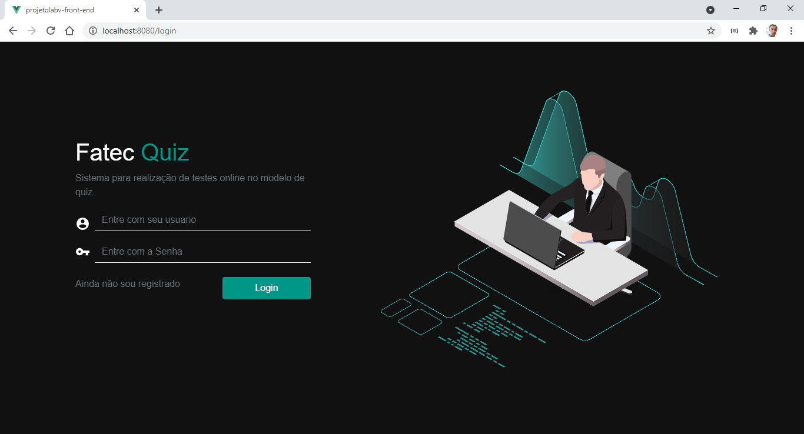

# **Projeto de LAB V - Parte 2:** _Desenvolvimento do Front-end com JavaScript, VueJs, Vuex, Axios e Router_.
**Aplicação:** Quis de Perguntas e Respostas

[](https://img.shields.io/github/license/robsoncartes/projetolabv-front-end/blob/master/LICENSE.md)

## FATEC SJC - Professor Jessen Vidal

### **Disciplina:** Laboratório de Desenvolvimento de Banco de Dados V

### **Professor:** Emanuel Mineda Carneiro

## Membros do Grupo

|    **Nome**    	|           **Email**          	|             **Github**            	|
|:--------------:	|:----------------------------:	|:---------------------------------:	|
| Rodolfo Santos 	| rodolfodossantos29@gmail.com 	| https://github.com/rodolfo-santos 	|
|  Robson Sousa  	|   robsoncartes@outlook.com   	|  https://github.com/robsoncartes  	|


\


## Project setup
```
npm install
```

### Compiles and hot-reloads for development
```
npm run serve
```

### Compiles and minifies for production
```
npm run build
```

### Lints and fixes files
```
npm run lint
```

### Customize configuration
See [Configuration Reference](https://cli.vuejs.org/config/).

See [More screens](windows-screen-shots/README.md)